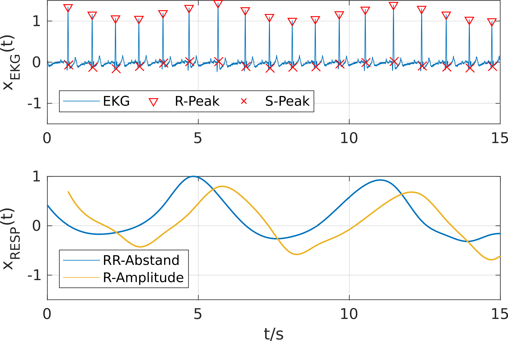

# ECG-based respiratory rate estimation
## Introduction
The purpose of this collection of functions is the indirect estimation of the respiratory rate from ECG signals. It accomplishes this by implementing several algorithms published by us ([Laboratory for Biosignal Processing](labp.github.io/)) or third parties.

## Installation
No installation is required. Just clone the repository to a folder of your choice and add it to your MATLAB path.

## Usage

## Algorithm
1. Feature extraction from the ECG
2. Estimation of the respiratory signal from the extracted features
3. Estimation of the fundamental frequency of the respiratory signal

### Feature Extraction
In a first step the function extracts features from the ECG signal that are correlated to respiration.

#### Heart Rate Variability
It has been shown, that slight variations of the heart rhythm are correlated with respiration. This so-called Respiratory Sinus Arrhythmia is a normal variation of the heart rate during inhalation and exhalation. The variation is releated to changes in intra-thoracic pressure during the breathing cycle [[1]](#1). The function calculates the RR-time series which is the time between subsequent heart beats.

#### R-Peak amplitude
During inhalation and exhalation ECG-electrodes change their position with respect to the heart. This causes fluctuations in the R-Peak Amplitude. During processing of the ECG signal the amplitude of the R-Peak with respect to the S-Point is computed which provides a robust estimation of the signal amplitude with respect to the baseline [[2]](#2).

#### QRS-Area
The area under curve between the Q and S points is being calculated. This feature has been used for detection of obstructive sleep apnea [[3]](#3).

### Estimation of the respiratory signal
To estimate the respiratory signal the extracted ECG-features are interpolated using cubic splines. To extract a clear signal the interpolated time series is filtered in the time domain using the Empirical Mode Decomposition. 
The following figure depicts this process using the R-peak amplitude. The estimated respiratory signal (blue) shows a strong correlation with the respiratory signal measured using a belt around the subject's chest (yellow).

### Estimation of the respiratory rate
The fundamental frequency of the respiratory signal (the respiratory rate) can be estimated using three different methodologies.

#### Autocorrelation
The fundamental frequency of periodic signals -- like respiratory signals -- can be estimated using its autocorrelation function. In the periodic case the autocorrelation function shows periodic maxima that correspond to integer multiples of the signal's fundamental frequency. The details of this method are outlined in [[4]](#4)

#### FFT
The respiratory signal is analized using the Fast Fourier Transform (FFT). The most prominent peak in the FFT-spectrum within a plausbible frequency range is interpreted as the respiratory rate.

#### Zero Crossing
The respiratory rate is estimated in the time domain. First, the mean is substractes from the respiratory signal. The respiratory frequency ist calculated based on the distance of the zero-crossings of the signal.

## References
<a id="1">[1]</a> Berntson, Gary G., John T. Cacioppo, and Karen S. Quigley. "Respiratory sinus arrhythmia: autonomic origins, physiological mechanisms, and psychophysiological implications." Psychophysiology 30.2 (1993): 183-196.

<a id="2">[2]</a> Zhao, Yanna, Jie Zhao, and Qun Li. "Derivation of respiratory signals from single-lead ECG." 2008 International Seminar on Future BioMedical Information Engineering. IEEE, 2008.

<a id="3">[3]</a> Maier, C., H. Wenz, and H. Dickhaus. "Robust detection of sleep apnea from holter ECGs." Methods of Information in Medicine 53.04 (2014): 303-307.

<a id="4">[4]</a> Schrumpf, Fabian, et al. "Derivation of the respiratory rate from directly and indirectly measured respiratory signals using autocorrelation." Current Directions in Biomedical Engineering 2.1 (2016): 241-245. ([Researchgate](https://www.researchgate.net/publication/305159527_Derivation_of_the_respiratory_rate_from_directly_and_indirectly_measured_respiratory_signals_using_autocorrelation))
